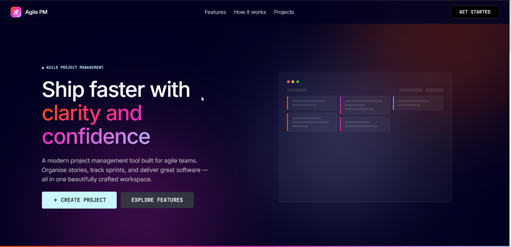
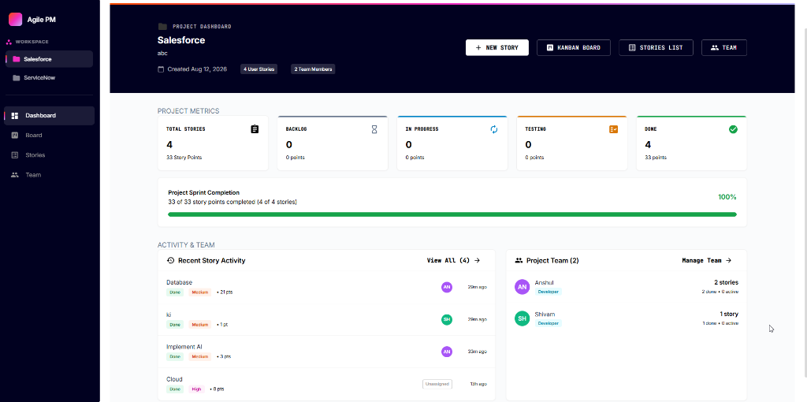
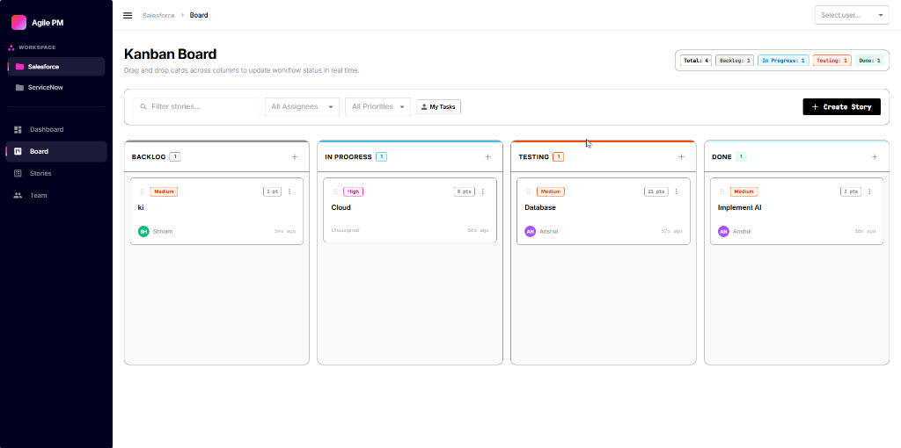
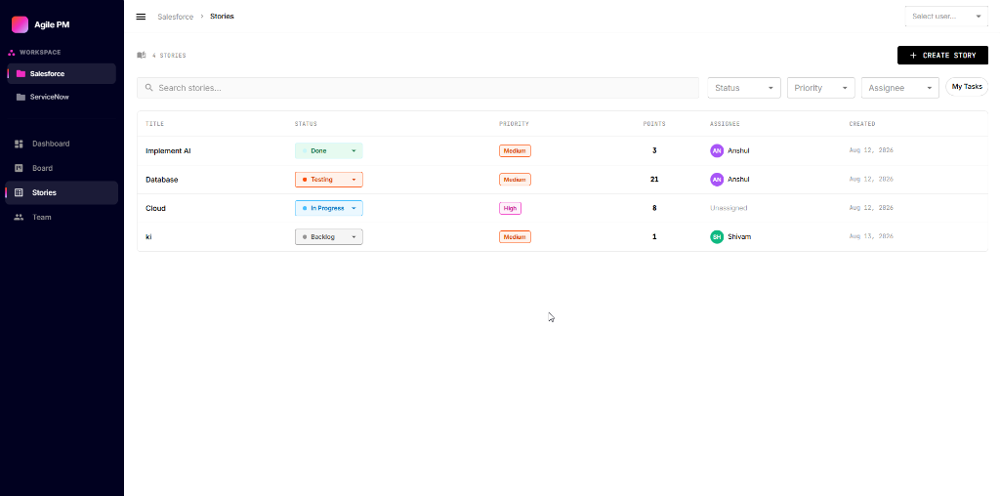
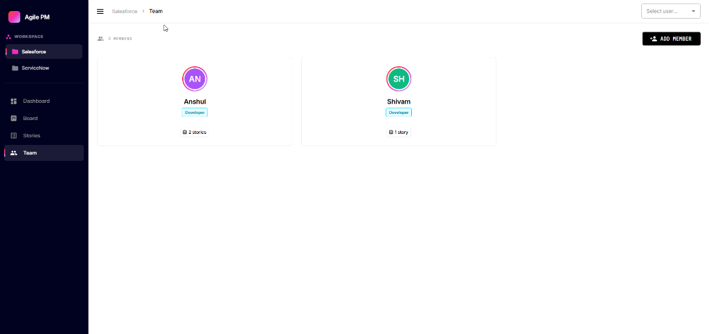

# ⚡ Agile PM — Modern Agile Project Management

> **Ship faster with clarity and confidence.**  
> A sleek, high-performance, single-page Agile Project Management web application built with React 19, TypeScript, Vite 8, and Material UI. Experience instant state updates, dynamic Kanban workflows, real-time metrics, and multi-project team collaboration—all running 100% client-side with zero backend required.

---

## 🌟 Overview

**Agile PM** reimagines project management by delivering a lightning-fast, zero-friction experience right in the browser. Designed with modern aesthetics inspired by high-contrast dark themes and polished brand chrome, Agile PM enables agile software teams to manage projects, track user story lifecycles, assign team members, and visualize sprint progress without complex server setups or API dependencies.

---

## 🚀 Key Features & UI Showcase

### 1. Dark-Themed Landing Page
The landing page provides a striking entrance to the application with a high-contrast dark aesthetic, gradient highlights, and quick project creation pathways.



- **Hero & Project Showcase**: Dynamic call-to-action buttons for starting new projects or exploring core features.
- **Glassmorphic Preview**: Interactive project preview cards with smooth transitions.

---

### 2. Interactive Project Dashboard
An executive-level overview of project metrics, progress indicators, recent story activity, and team workloads.



- **Project Metrics**: Instant visibility into total stories and points distributed across **Backlog**, **In Progress**, **Testing**, and **Done**.
- **Sprint Progress Bar**: Real-time completion percentage tracking story points delivered.
- **Recent Story Activity Stream**: Live feed showing status updates, priority tags, point values, and time elapsed.
- **Team Quick Overview**: Active team roster with story counts per member.

---

### 3. Drag-and-Drop Kanban Workflow Board
A dynamic board designed for visual task tracking and real-time status transitions across 4 workflow columns.



- **4 Workflow Columns**: *Backlog*, *In Progress*, *Testing*, and *Done*.
- **Visual Status Transitions**: Move stories seamlessly between workflow stages.
- **Multi-Criteria Filtering**: Filter by title/keyword, assignee dropdown, priority selector, or trigger the **"My Tasks"** toggle to view stories assigned to the active user.
- **Live Column Stats**: Badges showing story count per status column.

---

### 4. Tabular User Stories View
A detailed tabular list for full story management, multi-attribute filtering, and quick updates.



- **Rich Data Grid**: Clear visualization of Title, Status, Priority, Story Points, Assignee avatar, and Creation Date.
- **Inline Status & Priority Controls**: Change story statuses directly from table dropdowns with immediate UI sync across all views.
- **Search & Quick Filters**: Search by keyword or apply multi-select dropdown filters.

---

### 5. Team Directory & Role Management
Manage team members, roles, and workload distribution within each project workspace.



- **Member Cards**: Color-coded role chips (Developer, Product Owner, QA, Designer, Manager) and assigned story badges.
- **Add Team Member**: Quick modal to add new team members with custom roles.
- **Assignee Scope Sync**: Automatically updates the top header user selector and project story assignment options.

---

## 🛠️ Tech Stack & Architecture

- **Core Framework**: [React 19](https://react.dev/) + [TypeScript](https://www.typescriptlang.org/)
- **Build Tooling & HMR**: [Vite 8](https://vitejs.dev/)
- **Routing**: [React Router 7](https://reactrouter.com/) (BrowserRouter with deep-linkable URLs)
- **UI Components & Icons**: [Material UI (MUI)](https://mui.com/), [Lucide React](https://lucide.dev/), `@mui/icons-material`
- **Styling**: Emotion (`@emotion/react`, `@emotion/styled`), Custom CSS Design Tokens
- **State & Persistence**: React Context (`AppContext`) + Browser `localStorage` (100% Client-Side Persistence with initial mock seed data)

---

## 💻 Getting Started / Local Setup

Follow these simple steps to run Agile PM locally on your machine.

### Prerequisites

Ensure you have **Node.js** (v18.0.0 or higher recommended) and **npm** installed.

```bash
node -v
npm -v
```

### 1. Clone the Repository

```bash
git clone https://github.com/anshul280929/Project-Management-Project.git
cd agile-project-manager
```

### 2. Install Dependencies

```bash
npm install
```

### 3. Run Development Server

Start the Vite development server with Hot Module Replacement (HMR):

```bash
npm run dev
```

Open your browser and navigate to:
```
http://localhost:5173
```

---

## 📜 Available Scripts

In the project directory, you can run:

| Command | Description |
|---------|-------------|
| `npm run dev` | Starts the local development server |
| `npm run build` | Compiles TypeScript and builds the production bundle in `dist/` |
| `npm run preview` | Serves the production build locally for verification |
| `npm run lint` | Runs ESLint to check for code quality and style errors |

---

## 📁 Project Structure

```
agile-project-manager/
├── docs/
│   └── screenshots/         # Application screenshots used in documentation
│       ├── landing.png
│       ├── dashboard.png
│       ├── board.png
│       ├── stories.png
│       └── team.png
├── public/                  # Public static assets & icons
├── src/
│   ├── app/                 # App routing configuration
│   ├── components/          # Shared UI components (AppShell, Header, Sidebar, Dialogs)
│   ├── context/             # React Context for global state (AppContext)
│   ├── features/            # Feature modules (Dashboard, Kanban, Stories, Team, Projects)
│   ├── hooks/               # Custom React hooks (useProjects, useStories, useUsers)
│   ├── pages/               # Page-level components
│   ├── services/            # Storage service (LocalStorage sync & seed data initialization)
│   ├── types/               # TypeScript type definitions and interfaces
│   ├── utils/               # Helper utilities and formatters
│   ├── main.tsx             # Application entry point
│   └── theme.ts             # Custom Material UI theme configuration
├── index.html               # HTML template
├── package.json             # Project dependencies and npm scripts
├── tsconfig.json            # TypeScript configuration
└── vite.config.ts           # Vite configuration
```

---

## 💡 Key Architectural Highlights

1. **Zero Backend Overhead**: All CRUD actions dispatch synchronous state updates stored directly in `localStorage`.
2. **Real-time State Synchronization**: Any story status change made on the **Kanban Board** or **Stories Table** instantly updates the **Dashboard Metrics** and **Team Cards**.
3. **Simulated User Switcher**: Easily test user perspectives (e.g. "Anshul", "Shivam") using the top-right header selector to test "My Tasks" filtering.
4. **Collapsible Workspace Sidebar**: Hide or expand the navigation drawer at any resolution for an uncluttered workspace.

---

## 🤝 Contributing

Contributions are welcome! If you'd like to improve Agile PM:

1. Fork the repository
2. Create your feature branch (`git checkout -b feature/AmazingFeature`)
3. Commit your changes (`git commit -m 'Add some AmazingFeature'`)
4. Push to the branch (`git push origin feature/AmazingFeature`)
5. Open a Pull Request

---

## 📄 License

This project is open source and available under the [MIT License](LICENSE).
